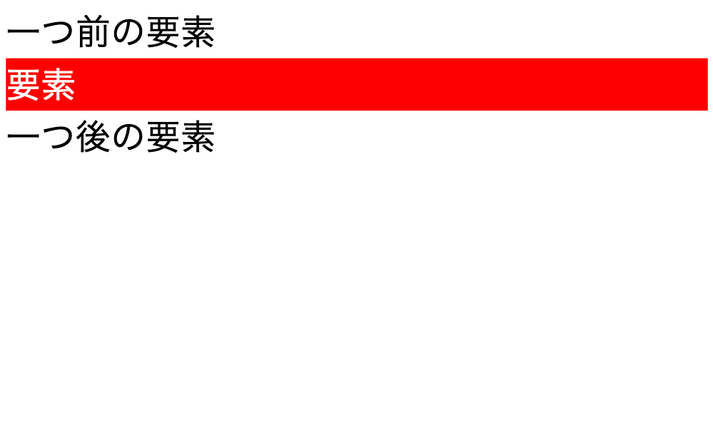

<!-- _class: lead -->

# 1. 導入編

---

### このセクションのゴール

- 環境構築を完了する
- Web サイトの基本的な構造を理解する
- HTML/CSS が書けるようになる
- GitHub Pages で Web サイトを公開できるようになる

---

### 目次

1. 準備
1. 最低限必要な知識
1. HTML とは
1. CSS とは
1. GitHub Pages での公開

---

<!-- _class: lead -->

## 01-1. 準備

---

### 事前準備

#### 必要なソフト

- [Git](https://git-scm.com/)
  - バージョン管理ツール
- [Visual Studio Code](https://code.visualstudio.com/)
  - コードエディタ

#### 必要なアカウント

- [GitHub](https://github.com/)
  - リモートリポジトリのホスティングサービス

---

### GitHub アカウントの作成

1. [GitHub](https://github.com/) にアクセス
1. 右上の`Sign up` をクリック
1. メールアドレス、パスワード、ユーザ名を設定
1. bot テストのミニゲームをクリア
1. メールで送られた認証コードを入力
1. プランは Free を選択

- メールアドレスは個人のものを推奨
- ユーザ名は他人と被っている場合利用できません


---

### Git のダウンロード

#### Windows の場合

1. [Git for Windows](https://gitforwindows.org/) にアクセス
1. **Click here to download** をクリック

#### Mac の場合

1. [XCode](https://developer.apple.com/xcode/)にアクセス
1. 右上の Download をクリック
1. App Store が開くので、 XCode をインストール


---

### Git のインストール

#### Windows の場合

1. ダウンロードフォルダにある exe ファイルをダブルクリック
1. ウィザードが立ち上がるので、基本的に右下の「Next」をクリックし続ける
1. 「Choosing the default editor used by Git」画面で、Use Visual Studio Code as Git's default editor を指定する


---

### Git の設定

- スタートメニュー(左下 Windows アイコン)から Git Bash を起動
  - Mac の場合は「アプリケーション」の「ユーティリティ」フォルダにあるターミナルを起動
- 下記のコマンドを入力して、ユーザ名とメールアドレスを設定

```bash
git config --global user.name "ここにGitHubのユーザ名"
```

```bash
git config --global user.email "ここにGitHubのメールアドレス"
```

- 特にエラーが出ていなければ設定完了

---

### Visual Studio Code のダウンロード

1. [Visual Studio Code](https://code.visualstudio.com/) にアクセス
2. OS に合わせてインストーラをダウンロード
3. インストール

#### 補足

- Microsoft が主導して開発しているオープンソースのコードエディタ
- 一般的に **VSCode** と呼ばれるので、本資料でも以降は VSCode と表記します

---

### Visual Studio Code の設定

#### 拡張機能のインストール

- VSCode を起動し、左側のアイコンから拡張機能を検索
- 「HTML CSS Support」と「Live Server」をインストール


---

<!-- _class: lead -->

## 1-2. 最低限必要な知識

---

### 心構え

#### 書き方を覚えようとしないでください。

量が膨大というのもありますが、特に Web 技術は日々進化しているため、数年前の常識が通用しないことがあります。個人的には写経（サンプルコードを書き写すこと）にも意味がないと思っているので、どんどんコピペしてください。

そもそもこれはテストではないので、「勉強」という意識を持たないほうがラクです。

---

### 心構え

#### 書き方を覚えるのではなく、調べ方を覚えてください。

詰まったときは信頼できるドキュメントを見るのが一番ですが、英語であることが多いので、ハードルを感じる場合は以下に挙げるサイトがおすすめです。

- [MDN Web Docs](https://developer.mozilla.org/ja/)
- [HTML&CSS 入門：イチから Web デザインを習得する講座](https://saruwakakun.com/html-css/basic)

ChatGPT や GitHub Copilot などの生成 AI を活用するのも良いでしょう。

---

### 各言語の役割

- HTML: 文書の構造を記述
  - 「ここが見出し」「ここが段落」など
- CSS: デザインを記述
  - 「見出しは赤色」「段落のフォントサイズは 16px」など
- JavaScript: 動的な挙動を記述
  - 「ボタンをクリックしたらローディングアニメーションを表示」など

ウェブページを開いたときに表示されているのは殆どの場合 HTML です。

基本的に CSS や JavaScript は HTML から呼び出されることが多いです。

---

<!-- _class: lead -->

## 01-3. HTML とは

---

### HTML とは

- HyperText Markup Language
  - 「マークアップ言語」であって「プログラミング言語」ではない
- 文書の構造を記述するための言語
- タグで囲まれた要素を使って構造を表現
- `index.html`というファイル名に特別な意味を持つ
  - `https://example.com/index.html`へのアクセスは`https://example.com/`と同じ

<div class="alert">

**HTML5**は 2014 年 10 月に W3C によって勧告された HTML のバージョン。2021 年 1 月に廃止され、以降は **HTML Living Standard** が有効な規格となっている

</div>

---

### HTML の基本構造

```html
<!DOCTYPE html>
<html lang="ja">
  <head>
    <meta charset="UTF-8" />
    <title>ページのタイトル</title>
  </head>
  <body>
    <!-- これはコメントで、実際には表示されません -->
    <h1>見出し</h1>
    <p>段落</p>
  </body>
</html>
```

これだけで表示することができる！

---

### HTML の基本的なルール

- 開始タグを書いたら必ず終了タグを書く
  - `<`で始まり`>`で終わっている部分がタグで、とくに`</`で始まっているものが終了タグ
  - ``タグや`<br/>`タグなど、一部例外あり
- Python などとは異なり、インデントの大きさは問わない
- コメントは`<!--`と`-->`で囲む
- 1 行目の`<!DOCTYPE html>`は 必ず書く
- `<html>`タグの中に`<head>`と`<body>`がある（この 3 つは必須）
- `<head>`タグの中にはページの情報を書く
- `<body>`タグの中にはページの内容を書く
  - ページを開いた時に表示されるのはこの部分

---

### HTML ファイルを作成してみよう

1. 作業用のフォルダ（`portfolio`など）を作成
1. VSCode を起動し、左上の「ファイル」→「フォルダを開く」から作成したフォルダを開く
1. 新しいファイルを作成（右図の赤丸）
1. ファイル名を`index.html`として保存

- フォルダ作成ボタンと間違えないように注意
- もしくは左上の「ファイル」→「新しいファイル」


---

### HTML をブラウザで表示してみよう

- 作成した HTML ファイルに先ほどのコードを書き込む

```html
<!DOCTYPE html>
<html lang="ja">
  <head>
    <meta charset="UTF-8" />
    <title>ページのタイトル</title>
  </head>
  <body>
    <h1>見出し</h1>
    <p>段落</p>
  </body>
</html>
```

- ファイルを保存し、VSCode 右下の「Go Live」をクリック
  - エクスプローラーから HTML ファイルをダブルクリックすることでも表示できますが、この方法を用いることでリアルタイムで（再読込することなく）変更を確認できます

---

### HTML をブラウザで表示してみよう

<div style="text-align: center;">

:tada: :tada: :tada:


</div>

---

### おもに使うタグ

| タグ                      | 説明                                       |
| ------------------------- | ------------------------------------------ |
| `<h1>` - `<h6>`           | 見出しを表現するタグ                       |
| `<p>`                     | 段落を表現するタグ                         |
| `<a>`                     | ハイパーリンクを作成するタグ               |
| ``                   | 画像を表示するタグ                         |
| `<ul>`, `<ol>`, `<li>`    | リストを表現するタグ                       |
| `<table>`, `<tr>`, `<td>` | 表を表現するタグ                           |
| `<div>`, `<span>`         | ブロック要素とインライン要素を表現するタグ |

---

### 別のページにリンクさせる

- VSCode で新しく`about.html`を作成し、以下のコードを書き込む

```html
<!DOCTYPE html>
<html lang="ja">
  <head>
    <meta charset="UTF-8" />
    <title>aboutページ</title>
  </head>
  <body>
    <h1>aboutページ</h1>
    <p>これはaboutです。</p>
    <a href="./index.html">トップページに戻る</a>
  </body>
</html>
```

- `index.html`の`body`タグ内に以下のコードを追加

```html
<a href="./about.html">aboutページへ</a>
```

---

### 画像を表示させる

- 画像をダウンロードして、HTML ファイルと同じフォルダに保存
  - 分かりやすくするために`images`フォルダなどを作成して配置することが多い
- `index.html`の`body`タグ内に以下のコードを追加
  - `your-image-name.png`はダウンロードした画像のファイル名

```html

```

- 必ず`alt`属性をつけること
  - 画像が表示できない場合に代替テキストとして表示される

---

### 箇条書きを作る

- `index.html`の`body`タグ内に以下のコードを追加

```html
<ul>
  <li>リスト1</li>
  <li>リスト2</li>
  <li>リスト3</li>
</ul>
```

- `ul`は unordered list の略で、順序のないリストを表現
- `li`は list item の略で、リストの各項目を表現

```html
<ol>
  <li>リスト1</li>
  <li>リスト2</li>
  <li>リスト3</li>
</ol>
```

- `ol`は ordered list の略で、順序のあるリストを表現

---

### 表を作る

- `index.html`の`body`タグ内に以下のコードを追加

<div style="display: flex;">
<div style="width: 50%">

```html
<table>
  <thead>
    <tr>
      <th>見出し1</th>
      <th>見出し2</th>
    </tr>
  </thead>
  <tbody>
    <tr>
      <td>1行目1列目</td>
      <td>1行目2列目</td>
    </tr>
    <tr>
      <td>2行目1列目</td>
      <td>2行目2列目</td>
    </tr>
  </tbody>
</table>
```

</div>
<div>

- `table`は表を表現
- `thead`は表の見出し部分
- `tbody`は表の本体部分
- `tr`は table row の略で、表の行を表現
- `th`は table header の略で、表の見出しを表現
- `td`は table data の略で、表のデータを表現

</div>
</div>

---

### 補足: タグのネスト

- これまでの例にもあったように、タグは入れ子にすることができる
- 例えば、リストの中にリストを入れることもできる

```html
<ul>
  <li>リスト1</li>
  <li>
    リスト2
    <ul>
      <li>リスト2-1</li>
      <li>リスト2-2</li>
    </ul>
  </li>
</ul>
```

- ただし、許容されていない組み合わせもあるので注意
  - 例えば、`a`タグの中に`a`タグを入れたり、`p`タグの中に`div`タグを入れたりするのは避ける

---

<!-- _class: lead -->

## 01-4. CSS とは

---

### CSS とは

- Cascading Style Sheets
  - スタイルシート言語
- 文書のデザインを記述するための言語
- セレクタとプロパティを使ってデザインを記述

---

### CSS の基本構造

```css
h1 {
  color: red;
  font-size: 32px;
}
p {
  background-color: lightgray;
  text-align: center;
}
```

- `セレクタ { プロパティ: 値; }`の形式で記述
- セレクタはタグ名や id、class など

---

### h1 タグの文字色を変えてみよう

- `style.css`というファイルを作成

<div style="display: flex; gap: 2rem;">
<div style="width: 50%">

- `index.html`を以下のようにする

```html
<!DOCTYPE html>
<html lang="ja">
  <head>
    <meta charset="UTF-8" />
    <title>ページのタイトル</title>
    <link rel="stylesheet" href="./style.css" />
  </head>
  <body>
    <h1>見出し</h1>
    <p>段落</p>
  </body>
</html>
```

</div>
<div>

- `style.css`に以下のコードを書き込む

```css
h1 {
  color: red;
}
```

</div>
</div>

- `head`タグ内に`<link rel="stylesheet" href="./ファイル名.css" />`を追加することで CSS ファイルを読み込むことができる

---

### id と class

- id はページ内で一意の要素を指定するための属性
  - 1 ページで 1 回しか使うことができない
- class は複数の要素に同じスタイルを適用するための属性
  - 複数の要素に同じスタイルを適用したい場合に使う

```html
<h1 id="title">文字色が赤になる</h1>
<p class="description">ここの背景がグレーになる</p>
```

```css
#title {
  color: red;
}
.description {
  background-color: lightgray;
}
```

- CSS では名前の前に、 id は`#`、class は`.`をつける
- バグを防ぐため id は使わず class を使うことが多い

---

### 詳細度 ①

```html
<h1 id="title_id" class="title_class">見出し</h1>
```

```css
#title_id {
  color: blue;
}
.title_class {
  color: green;
}
h1 {
  color: red;
}
```

このとき、見出しは何色になる？

---

### 詳細度 ②

- 複数のセレクタが同じ要素を指定している場合、詳細度が高いものが優先される
- 基本的には最後に書かれたスタイルが優先されるが、詳細度によっては逆転する場合がある
- 基本的に id セレクタ > class セレクタ > タイプセレクタ の順に詳細度が高い

<div class="alert">
実際のところ詳細度の計算はより複雑で、CSSが難しいとされる理由の一つだったりします。
</div>

---

### おもに使うプロパティ

| プロパティ名       | 説明             |
| ------------------ | ---------------- |
| `color`            | 文字色を変更     |
| `background-color` | 背景色を変更     |
| `font-size`        | 文字サイズを変更 |
| `padding`          |                  |
| `margin`           |                  |
| `border`           | 枠線に関する設定 |

---

### padding と margin

- padding は要素の内側の隙間、margin は要素の外側の隙間

```html
<div>一つ前の要素</div>
<div class="target">要素</div>
<div>一つ後の要素</div>
```

<div style="display: flex; justify-content: space-between;">
<div style="width: 30%">

- 何も指定しないとき

```css
// 見やすさのため色のみ設定
.target {
  background-color: red;
  color: white;
}
```



</div>
<div style="width: 30%">

- padding だけ指定したとき

```css
.target {
  background-color: red;
  color: white;
  padding: 16px;
}
```


</div>
<div style="width: 30%">

- margin だけ指定したとき

```css
.target {
  background-color: red;
  color: white;
  margin: 16px;
}
```


</div>
</div>

---

### 色に関するプロパティ

- `color`、`background-color` など
- 指定方法はさまざま
  - キーワード: `red`, `blue`, `green` など
  - RGB: `rgb(255, 0, 0)`
  - HEX(いわゆるカラーコード): `#ff0000`
  - HSL: `hsl(0, 100%, 50%)`

<div class="alert">
色に困ったときはMaterial Colorsなどのカラーパレットサイトを使うと便利です。

https://materialui.co/colors

</div>

---

### 数値を扱うプロパティ

- `px` ピクセル
- `%` パーセント
- `em` 親要素のフォントサイズに対する相対的な大きさ
  - `1em` は親要素のフォントサイズと同じ
- `rem` ルート要素のフォントサイズに対する相対的な大きさ
  - `1rem` は`<html>`タグのフォントサイズと同じ

最初は`px`を使っても良いが、レスポンシブデザインを考えると`%`や`rem`を使うほうが良い

<div class="alert">
レスポンシブデザイン：デバイスの画面サイズに合わせて（パソコンやスマホに応じて）デザインを変えること
</div>

---

### 枠線をつける

- `border: 線の太さ 線の種類 線の色`で指定できる

```css
.target {
  border: 1px solid black;
}
```

- 線の種類
  - `solid`: 実線
  - `dotted`: 点線
  - `dashed`: 破線
  - `double`: 二重線
  - `none`: 線なし

---

### 疑似要素

- `::before`、`::after` などの疑似要素を使うことで、要素の前後に要素を追加できる
- メリットとしては HTML を変えることなく装飾を加えることができる
- 実際には`content`の値を空にして、`<div>`タグのように装飾することが多い

<div style="display: flex; justify-content: space-between;">
<div style="width: 60%; margin-top: 2rem;">

```html
<div class="target">要素</div>
```

```css
.target::before {
  content: "前";
  background-color: red;
}
.target::after {
  content: "後";
  background-color: red;
}
```

</div>
<div>


<div>

---

### 実例: 見出しのデザイン

<div style="display: flex; justify-content: space-between; margin-top: 1rem;">
<div style="width:68%;">

```css
h1 {
  font-size: 3rem;
  text-align: center;
  padding: 1rem;
  margin: 1rem;
  color: white;
  background: linear-gradient(to bottom right, blue, pink);
  border-radius: 1.5rem;
}
```

</div>
<div style="width: 30%;">


</div>
</div>

- `text-align: center`で中央揃え
- `linear-gradient`でグラデーションを作成
  - 角度、起点の色、終点の色を指定
  - 詳細は[linear-gradient() - CSS: カスケーディングスタイルシート | MDN](https://developer.mozilla.org/ja/docs/Web/CSS/gradient/linear-gradient)を参照
- `border-radius`で角を丸く

---

<!-- _class: lead -->

## 01-5. GitHub Pages での公開

---

### GitHub Pages とは

- GitHub が提供する静的 Web ホスティングサービス
- 以前はレンタルサーバーを契約し、FTP クライアントなどを使って公開したいファイルをアップロードする必要があったが、近年は Git でソースコードを管理し、GitHub に push するだけで Web サイトを公開できるサービスが増えている
- 同様の他のサービスとしては Netlify や Vercel, Firebase Hosting, Cloudflare Pages などがある（いずれも無料で公開可能）

---

### Git と GitHub の違い

- **Git**はプログラムのバージョンを管理するための**ソフトウェア**
- **GitHub**は Git で管理されたプログラムをクラウド上で管理するための**Web サービス**
  - 同様の Web サービスとして GitLab, Bitbucket などもある
- GitHub は Git の機能に加え、Issue(プロジェクトの問題やタスク) を管理する機能や共同開発を支援する機能などを提供している
- GitHub Pages は GitHub が提供するサービスの一つ

---

### GitHub でリポジトリを作成する

- [GitHub にログインし、右上の「+」をクリックして「New repository」を選択](https://github.com/new)
- Repository name にはお好きなものを
  - `https://username.github.io/[ここがリポジトリ名になる]/`
- Public/Private は自由
  - 認証情報を載せないよう注意！
- Create repository をクリック
- 作成後に遷移したページの URL をコピー


---

### Git でコミット＆プッシュする

- VSCode 左上のメニューから「ターミナル」→「新しいターミナル」を選択
- 以下のコマンドを入力

```bash
git init
git add .
git commit -m "first commit"
git remote add origin さっきコピーしたURL
git push origin main
```

- コマンドは 1 行ずつ実行（Enter）
- 最後のコマンドに失敗する場合、`main`を`master`に変更
- いまのところコマンドの意味を理解する必要はありません！

---

### GitHub Pages で公開する

- コマンド実行後、GitHub で開いているページをリロード
- 「Settings」→「Pages」を選択
- Branch を main（または master） にして Save


---

### 公開できたことを確認

- Code タブに戻り、黄色い丸が緑のチェックマークになるまで待つ
  - 30 秒程度でリロードしてみてください
- 右下の Deployments の github-pages をクリックし、URL をクリック！


---

<!-- _class: lead -->

第 1 回の内容は以上です。お疲れ様でした！
