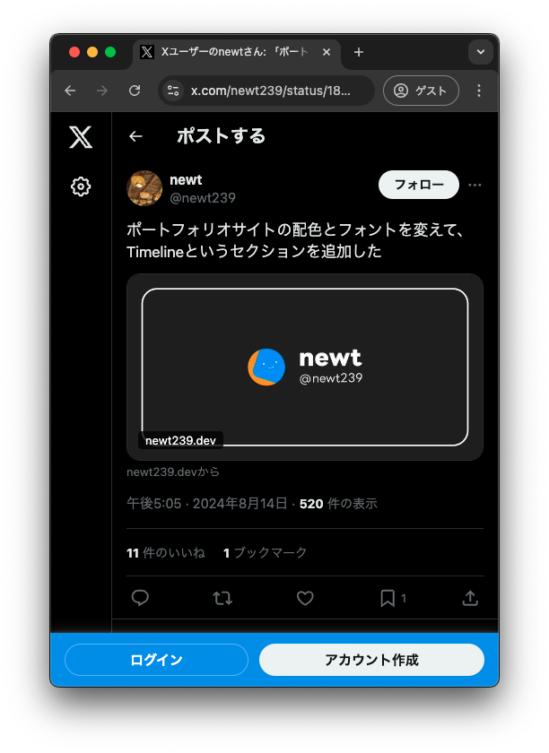
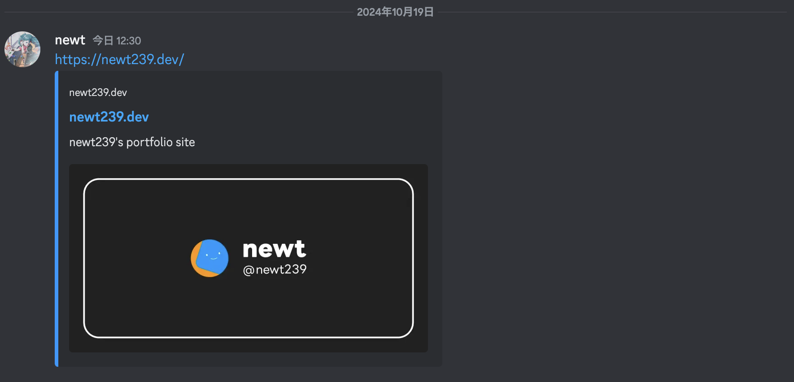
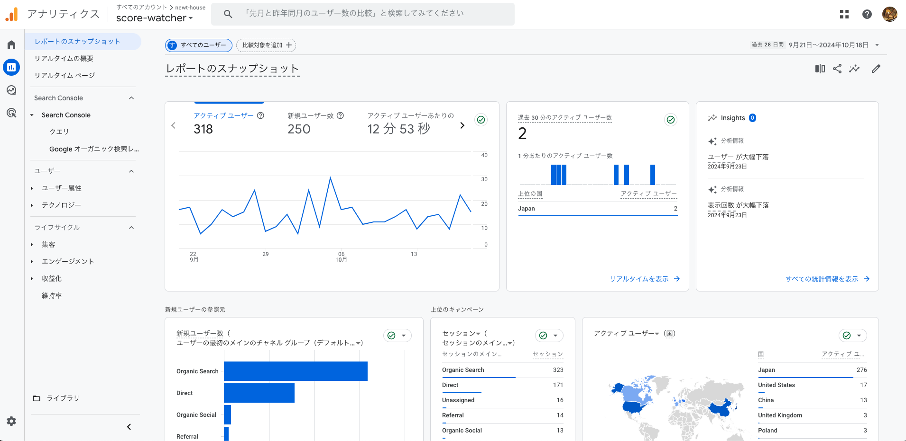
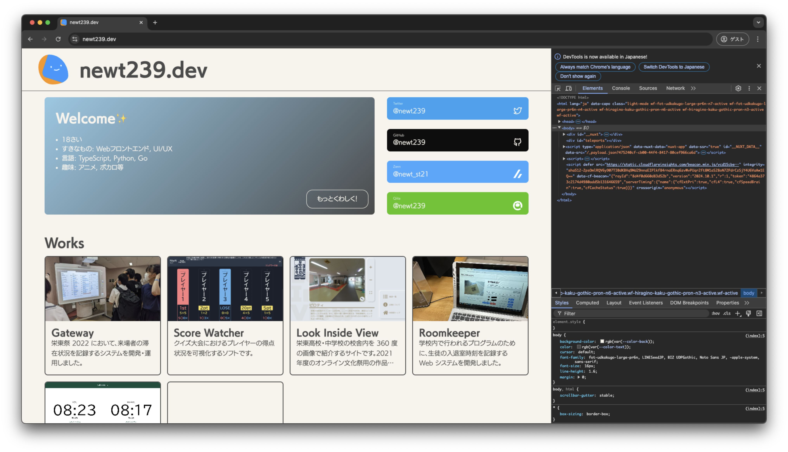
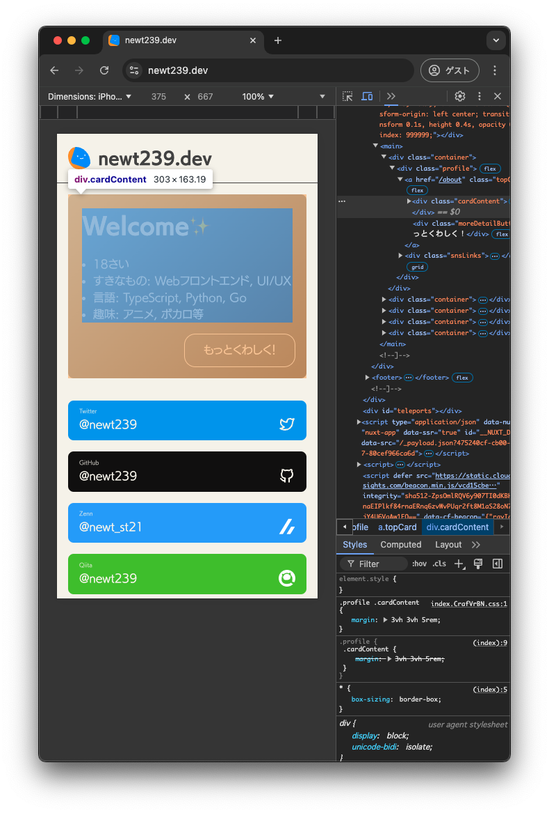

<!-- _class: lead -->

# 2. 実践編

---

### このセクションのゴール

- HTML/CSS に慣れる
- 実用的なデザインを作れるようになる
- サイト訪問者を増やすための工夫を知る

---

### 目次

1. flexbox について
1. `position` プロパティについて
1. レスポンシブデザイン
1. SNS で注目してもらうための工夫
1. アクセス解析の導入
1. ユーザーフレンドリーなサイトを作るために

---

<!-- _class: lead -->

## 02-1. flexbox について

---

### flexbox とは

<div style="display: flex; padding-top: 1rem; gap: 1rem;">
<div style="width: 50%">

```html
<div class="container">
  <div class="item">
    <h2>Work 1</h2>
    
    <p>This is description.</p>
  </div>
  <div class="item">
    <h2>Work 2</h2>
    
    <p>This is description.</p>
  </div>
  <div class="item">
    <h2>Work 3</h2>
    
    <p>This is description.</p>
  </div>
</div>
```

</div>
<div style="width: 50%">

- 要素の配置を柔軟に行うためのレイアウトモデル
- 横並べ、縦並べ、折り返し、均等配置などを簡単に実現できる
- CSS で親要素に対して`display: flex;`を指定することで有効になる

```css
.container {
  display: flex;
}
```

</div>

---

### flexbox の基本

```css
.container {
  display: flex; /* flexbox を有効にする */
  flex-wrap: wrap; /* 要素の折り返すかどうか */
  flex-direction: row; /* 要素の並び方向 */
  gap: 1rem; /* 要素間の間隔 */
  justify-content: space-between; /* 横方向の配置 */
  align-items: center; /* 縦方向の配置 */
}
```

- このあたりは良質な記事がたくさん出ているので、そちらを読んだほうが分かりやすいと思います
  - [日本語対応！CSS Flexbox のチートシートを作ったので配布します | Web クリエイターボックス](https://www.webcreatorbox.com/tech/css-flexbox-cheat-sheet)
  - [Flexbox 入門 - 横並びを実現する定番の CSS - ICS MEDIA](https://ics.media/entry/13117/)

---

### 実装例：カードデザイン

コード量が多いので、以降ソースコードは Gist で公開します。

- https://gist.github.com/newt239/82bccbf2234114c8f65f69d1f3a6a206
- `overflow: hidden;`（[12 行目](https://gist.github.com/newt239/82bccbf2234114c8f65f69d1f3a6a206#file-style-css-L12)）
  - 要素の内容がはみ出たときに、はみ出た部分を非表示にする
- `object-fit: cover;`（[29 行目](https://gist.github.com/newt239/82bccbf2234114c8f65f69d1f3a6a206#file-style-css-L29)）
  - 画像のアスペクト比を保ったまま、要素に収まるように拡大・縮小


---

<!-- _class: lead -->

## 02-2. `position` プロパティについて

---

### `position` プロパティ

- 要素の配置方法を指定するプロパティ
- `static`（デフォルト）, `relative`, `absolute`, `fixed`, `sticky` の 5 種類がある
- ある要素を基準にして別の要素を配置したい時に利用する

---

### 実装例：見出しの装飾


- https://gist.github.com/newt239/a4ad4b5565e46a2c7ef8416a0377bd47
- `transform`プロパティ
  - `rotate`で要素を回転
  - `translate`で要素を移動（[91 行目](https://gist.github.com/newt239/a4ad4b5565e46a2c7ef8416a0377bd47#file-style-css-L91)）
  - `scale`で要素を拡大・縮小
  - `skew`で要素を傾ける（[53 行目](https://gist.github.com/newt239/a4ad4b5565e46a2c7ef8416a0377bd47#file-style-css-L53)）

---

### 実装例：固定されたヘッダー

- https://gist.github.com/newt239/b7576ef08e2770392d94fbb437836630
- ページ内リンク（[HTML 17 行目](https://gist.github.com/newt239/b7576ef08e2770392d94fbb437836630#file-index-html-L17)）
  - a タグで id を指定した要素に飛ぶ
- ページ内リンクのスクロール方法（[1 行目](https://gist.github.com/newt239/b7576ef08e2770392d94fbb437836630#file-style-css-L1)）
  - `scroll-behavior: smooth;`でスクロールを滑らかにする
  - `scroll-margin-top`でスクロール位置を調整（ヘッダーの高さ分ずらす）
- `z-index`プロパティ（[20 行目](https://gist.github.com/newt239/b7576ef08e2770392d94fbb437836630#file-style-css-L20)）
  - 要素の重なり順を指定。大きいほど手前に表示される


---

<!-- _class: lead -->

## 02-3. レスポンシブデザイン

---

### レスポンシブデザインとは

- 画面サイズに応じてデザインを変更すること
- モバイルファースト（スマホサイトを優先して作る）が主流
- CSS のメディアクエリという機能を使って実装する
- 必ず head タグ内に`<meta name="viewport" content="width=device-width, initial-scale=1.0">`を記述しておくこと

---

### メディアクエリ

```css
/* 例：画面幅が 600px 以下の時 */
@media screen and (600px <= width) {
  /* ここにスタイルを記述 */
}
```

- `screen`：通常の画面表示用
  - 他に印刷時用の`print`や音声読み上げ用の`speech`などがある（滅多に使わない）
- `600px <= width`：画面幅が 600px 以下の時
  - このスコープ内に書かれたスタイルは、画面幅が 600px 以下の時のみ適用される
  - 従来は`max-width: 600px`と書く必要があったが、最近この記法が導入され、`600px <= width < 900px`のような範囲指定も可能に

---

### calc 関数

- CSS の計算式を記述する関数
- 画面幅に応じて要素のサイズを変化させるのに便利

```css
.container {
  width: calc(100% - 20px); /* 画面幅から 20px を引いた幅 */
  height: calc(100vh - 4rem); /* 画面高さから 4rem を引いた高さ */
}
```

---

### min 関数・max 関数・clamp 関数

- CSS でより小さい値や大きい値を指定するための関数

```css
.container {
  width: min(100%, 600px); /* 画面幅と 600px のうち小さい方 */
  height: max(100vh, 600px); /* 画面高さと 600px のうち大きい方 */
  font-size: clamp(
    1rem,
    2vw,
    2rem
  ); /* 1rem ～ 2rem の範囲で、画面幅に応じて変化 */
}
```

- これらの関数の中では calc 関数のように複数の単位を組み合わせることができる
- 関数を組み合わせることもできる

---

### 実装例：レスポンシブなナビゲーション

- https://gist.github.com/newt239/7
-


---

<!-- _class: lead -->

## 02-4. SNS で注目してもらうための工夫

---

### OGP とは

- Open Graph Protocol の略
- Facebook が提唱したメタデータの一つ
- SNS にシェア時に表示されるタイトル、画像、説明文などを指定できる

<div style="display: flex; gap: 1rem;">



<div style="margin: 1rem;">



</div>
<div style="margin: 1rem;">


</div>

</div>

---

### OGP の設定方法

- head タグ内に以下のタグを追加

```html
<meta name="description" content="newt239's portfolio site" />
<meta property="og:title" content="newt239.dev" />
<meta property="og:type" content="website" />
<meta property="og:site_name" content="newt239.dev" />
<meta property="og:description" content="newt239's portfolio site" />
<meta property="og:image" content="https://newt239.dev/og-image.webp" />
<meta property="og:url" content="https://newt239.dev" />
<meta property="twitter:card" content="summary_large_image" />
<meta property="twitter:title" content="newt239.dev" />
<meta property="twitter:description" content="newt239's portfolio site" />
<meta property="twitter:image" content="https://newt239.dev/og-image.webp" />
<meta property="twitter:site" content="@newt239" />
<meta property="twitter:creator" content="@newt239" />
<meta property="twitter:domain" content="newt239.dev" />
```

---

### 各タグの意味

| プロパティ       | 説明                                                                                                                                                                                    |
| ---------------- | --------------------------------------------------------------------------------------------------------------------------------------------------------------------------------------- |
| `description`    | ページの説明文。Google の検索結果でページタイトルの下に表示される文章だが、設定されていなければ Google が適当な分を抽出してくれるので、中身のない文を書くよりは設定しないほうが良いかも |
| `og:title`       | ページタイトル。`<title>`タグと同じものを書くことが多い                                                                                                                                 |
| `og:type`        | コンテンツの種類。`website`で Web サイトのトップページ、`article`で記事ページ等                                                                                                         |
| `og:site_name`   | サイト名                                                                                                                                                                                |
| `og:description` | 説明文。`description`と同じ                                                                                                                                                             |
| `og:image`       | サムネイル画像                                                                                                                                                                          |
| `og:url`         | サイトの URL                                                                                                                                                                            |

---

### Twitter 用の設定

| プロパティ            | 説明                                                             |
| --------------------- | ---------------------------------------------------------------- |
| `twitter:title`       | ページタイトル                                                   |
| `twitter:description` | 説明文                                                           |
| `twitter:image`       | サムネイル画像                                                   |
| `twitter:card`        | Twitter カードの種類。`summary`か`summary_large_image`を指定する |
| `twitter:site`        | サイトの Twitter ID                                              |
| `twitter:creator`     | 作成者の Twitter ID                                              |
| `twitter:domain`      | ドメイン                                                         |

---

### OGP 画像を作るときのコツ

- SNS によって表示される画像のサイズが異なるため、見せたい部分が切れないよう注意
  - 画像サイズを 1200px × 630px にする（Twitter の推奨サイズ）
  - 余白を十分にとり、重要な要素（テキストなど）を中心に配置
- [OGP 確認 | ラッコツールズ](https://rakko.tools/tools/9/)などの OGP チェッカーを使うと良い
- Twitter の場合、一度 URL をツイートしてしまうと OGP がキャッシュされるため、変更が反映されないことがある
  - ツイートの文を書いただけでキャッシュされる
  - キャッシュされると約 1 週間は変更が反映されないので注意！
- 画像の URL は絶対パスで指定する必要がある
  - ``タグの`src`属性のようにファイル名だけの指定はできない
  - 画像が配置されるはずの URL を指定する
  - images フォルダに`og-image.webp`という名前で画像を配置し Github Pages で公開する場合、`https://username.github.io/リポジトリ名/images/og-image.webp`と指定する

---

<!-- _class: lead -->

## 02-5. アクセス解析の導入

---

### アクセス解析とは

- Web サイトのアクセス状況を分析すること
- ユーザー数、ページビュー数、滞在時間、リファラー（どのサイトから来たか）などを把握できる
- Google Analytics が有名

<div style="text-align: center;">



</div>

---

### Google Analytics の導入方法

1. [Google Analytics](https://analytics.google.com/)にアクセス
1. 新しいプロパティを作成し、トラッキング ID （`G-`から始まるもの）を取得
1. head タグ内に以下のタグを追加

```html
<script
  async
  src="https://www.googletagmanager.com/gtag/js?id=トラッキングID"
></script>
```

```html
<script>
  window.dataLayer = window.dataLayer || [];
  function gtag() {
    dataLayer.push(arguments);
  }
  gtag("js", new Date());
  gtag("config", "トラッキングID");
</script>
```

---

### 導入時の注意点

- トラッキング ID はサイトごとに別のものを使う
- 反映に時間がかかることがある
- 導入できたか確認するために[Google Analytics Debugger](https://chromewebstore.google.com/detail/google-analytics-debugger/jnkmfdileelhofjcijamephohjechhna)という拡張機能を使うと良い

---

<!-- _class: lead -->

## 02-6. ユーザーフレンドリーなサイトを作るために

---

### 開発者ツール ①

- ブラウザには開発者ツールという機能が搭載されており、Web サイト のデバッグや検証に使える
- Google Chrome・Microsoft Edge の場合
  - 右クリック →「検証」または`Ctrl + Shift + I`または`F12`

<div style="text-align: center;">



</div>

---

### 開発者ツール ②

- Elements タブで HTML 要素の構造を確認
- 要素を選択すると、下にその要素のスタイルが表示される
- その場で要素のスタイルを変更して検証することができる
- スマートフォンでの表示をエミュレーションすることも可能



---

### 画像を軽量化

- ユーザーはあらゆる環境からアクセスする可能性がある
- モバイルデータ通信を利用しているユーザーのためにサイトの読み込みに必要な帯域を減らしてあげよう
- Web サイトに表示する画像はできるだけ軽量化する
  - WebP という形式に変換
  - Google が提供している[Squoosh](https://squoosh.app/)というツールがおすすめ

---

### 画像には代替テキストをつける

- 視覚障害者がコンテンツの内容を把握するために有効
  - ページにおける役割だけでなく、画像がどのように見えるかを言語化して説明するとなお良い
- 通信速度が遅く画像を読み込めない場合や、リンクが切れている場合にも代替テキストが表示される
- Google 検索のクローラがサイトを評価する際の助けにもなる


---

### アクションに対するフィードバックを明確に

- リンクやボタンをホバー・クリックした際に、対象の要素に動きをつけることで、正しく反応できていることをユーザーに伝える
- `:hover`や`:click`などの疑似クラスを使って実装する

```css
a:hover {
  color: red;
}
button:click {
  transform: scale(1.1);
}
```

---

<!-- _class: lead -->

第 2 回の内容は以上です。お疲れ様でした！
