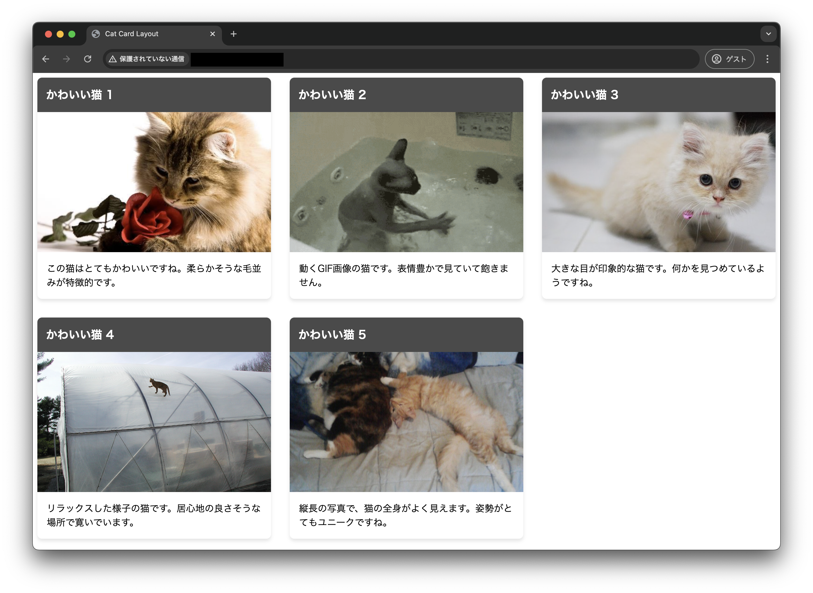
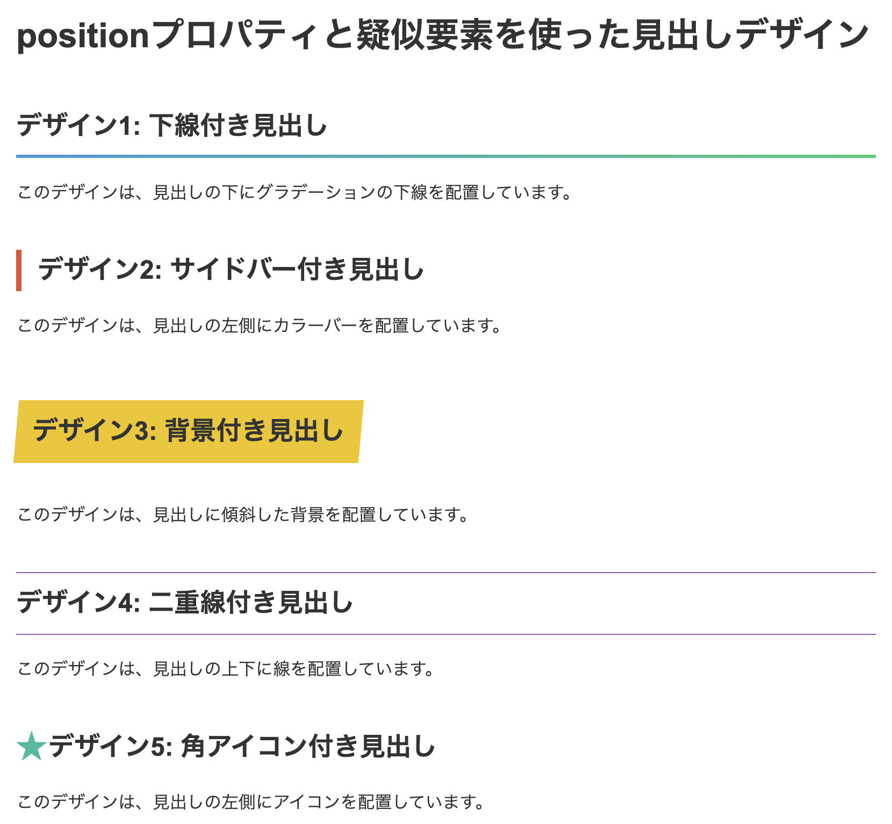
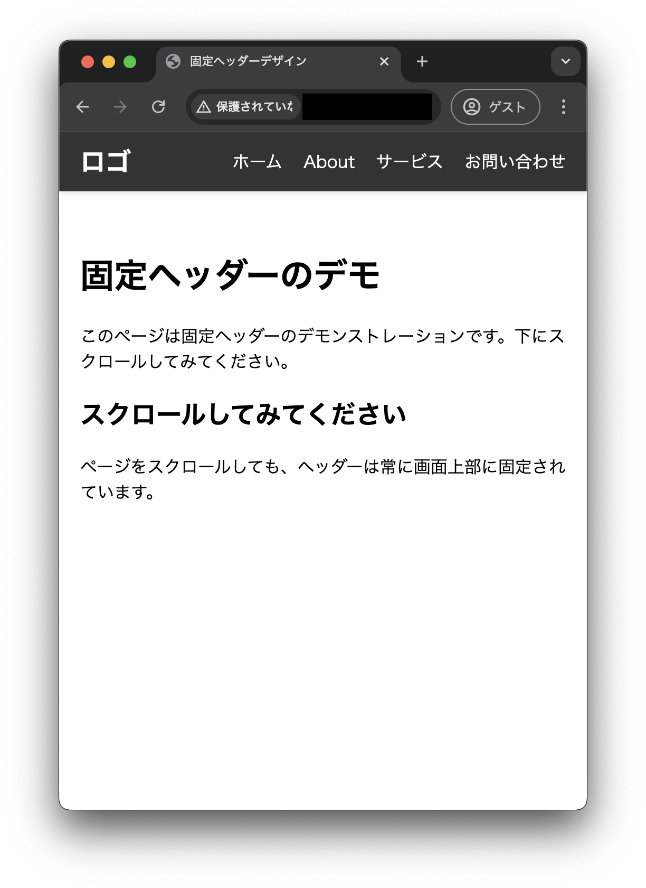

<!-- _class: lead -->

# 1. 実践編

---

### このセクションのゴール

- HTML/CSS に慣れる
- 実用的なデザインを作れるようになる
- サイトに簡単な動きをつける

---

### 目次

1. flexbox について
1. `position` プロパティについて
1. レスポンシブデザイン
1. JavaScript
1. カルーセルを実装する

---

<!-- _class: lead -->

## 02-1. flexbox について

---

### flexbox とは

<div style="display: flex; padding-top: 1rem; gap: 1rem;">
<div style="width: 50%">

```html
<div class="container">
  <div class="item">
    <h2>Work 1</h2>
    
    <p>This is description.</p>
  </div>
  <div class="item">
    <h2>Work 2</h2>
    
    <p>This is description.</p>
  </div>
  <div class="item">
    <h2>Work 3</h2>
    
    <p>This is description.</p>
  </div>
</div>
```

</div>
<div style="width: 50%">

- 要素の配置を柔軟に行うためのレイアウトモデル
- 横並べ、縦並べ、折り返し、均等配置などを簡単に実現できる
- CSS で親要素に対して`display: flex;`を指定することで有効になる

```css
.container {
  display: flex;
}
```

</div>

---

### flexbox の基本

```css
.container {
  display: flex; /* flexbox を有効にする */
  flex-wrap: wrap; /* 要素の折り返すかどうか */
  flex-direction: row; /* 要素の並び方向 */
  gap: 1rem; /* 要素間の間隔 */
  justify-content: space-between; /* 横方向の配置 */
  align-items: center; /* 縦方向の配置 */
}
```

- このあたりは良質な記事がたくさん出ているので、そちらを読んだほうが分かりやすいと思います......
  - [日本語対応！CSS Flexbox のチートシートを作ったので配布します | Web クリエイターボックス](https://www.webcreatorbox.com/tech/css-flexbox-cheat-sheet)
  - [Flexbox 入門 - 横並びを実現する定番の CSS - ICS MEDIA](https://ics.media/entry/13117/)

---

### 実装例：カードデザイン

コード量が多いので、以降ソースコードは Gist で公開します。

- https://gist.github.com/newt239/82bccbf2234114c8f65f69d1f3a6a206
- `overflow: hidden;`（[12 行目](https://gist.github.com/newt239/82bccbf2234114c8f65f69d1f3a6a206#file-style-css-L12)）
  - 要素の内容がはみ出たときに、はみ出た部分を非表示にする
- `object-fit: cover;`（[29 行目](https://gist.github.com/newt239/82bccbf2234114c8f65f69d1f3a6a206#file-style-css-L29)）
  - 画像のアスペクト比を保ったまま、要素に収まるように拡大・縮小



---

<!-- _class: lead -->

## 02-2. `position` プロパティについて

---

### `position` プロパティ

- 要素の配置方法を指定するプロパティ
- `static`（デフォルト）, `relative`, `absolute`, `fixed`, `sticky` の 5 種類がある
- ある要素を基準にして別の要素を配置したい時に利用する

---

### 実装例：見出しの装飾



- https://gist.github.com/newt239/a4ad4b5565e46a2c7ef8416a0377bd47
- `transform`プロパティ
  - `rotate`で要素を回転
  - `translate`で要素を移動（[91 行目](https://gist.github.com/newt239/a4ad4b5565e46a2c7ef8416a0377bd47#file-style-css-L91)）
  - `scale`で要素を拡大・縮小
  - `skew`で要素を傾ける（[53 行目](https://gist.github.com/newt239/a4ad4b5565e46a2c7ef8416a0377bd47#file-style-css-L53)）

---

### 実装例：固定されたヘッダー

- https://gist.github.com/newt239/b7576ef08e2770392d94fbb437836630
- ページ内リンク（[HTML 17 行目](https://gist.github.com/newt239/b7576ef08e2770392d94fbb437836630#file-index-html-L17)）
  - a タグで id を指定した要素に飛ぶ
- ページ内リンクのスクロール方法（[1 行目](https://gist.github.com/newt239/b7576ef08e2770392d94fbb437836630#file-style-css-L1)）
  - `scroll-behavior: smooth;`でスクロールを滑らかにする
  - `scroll-margin-top`でスクロール位置を調整（ヘッダーの高さ分ずらす）
- `z-index`プロパティ（[20 行目](https://gist.github.com/newt239/b7576ef08e2770392d94fbb437836630#file-style-css-L20)）
  - 要素の重なり順を指定。大きいほど手前に表示される


