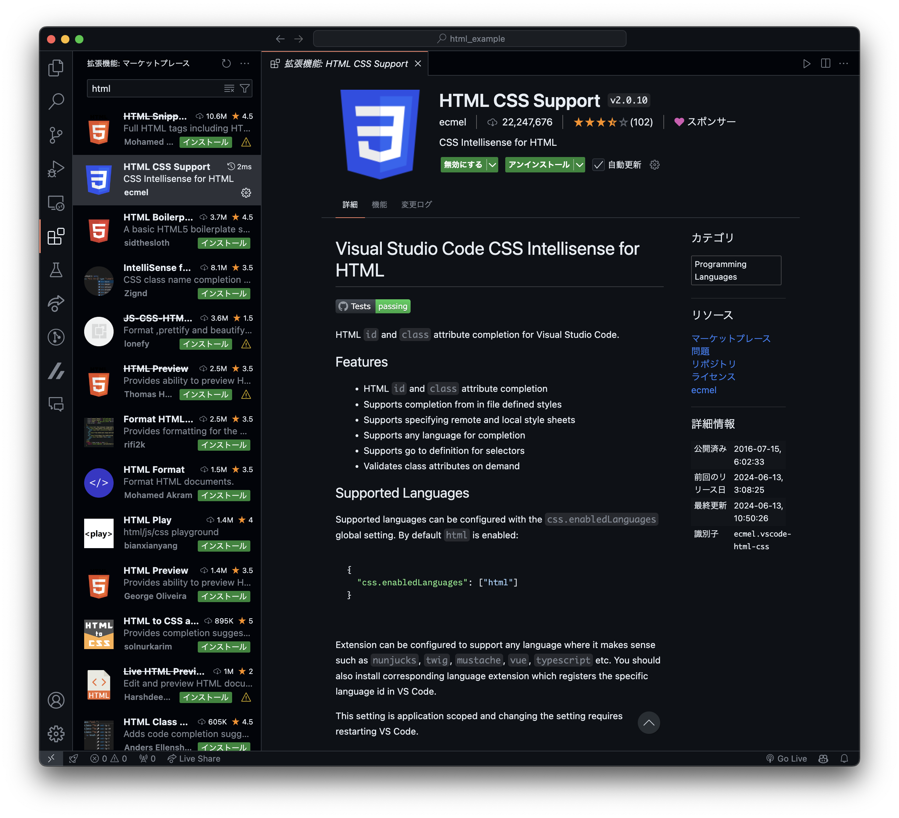
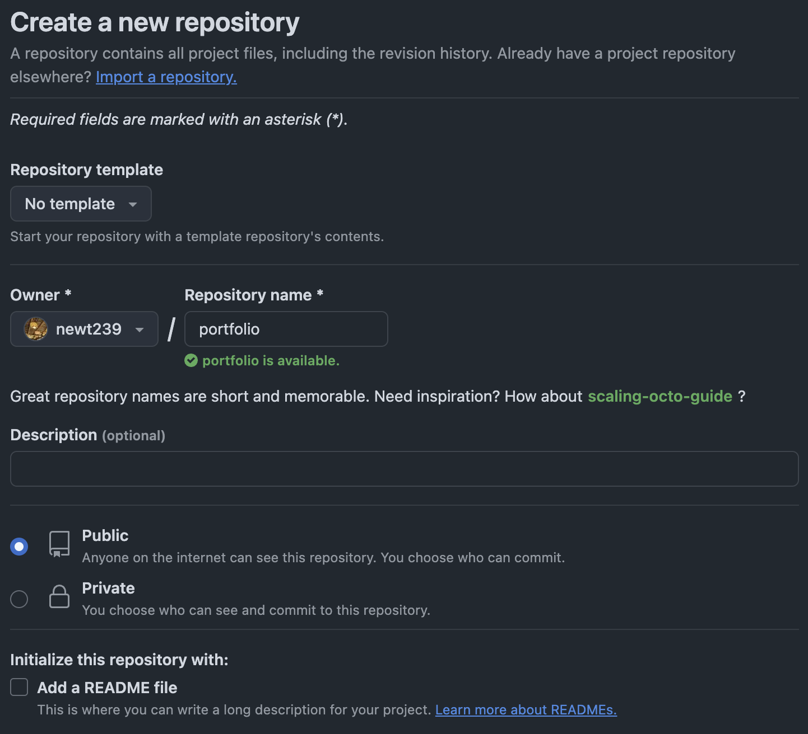
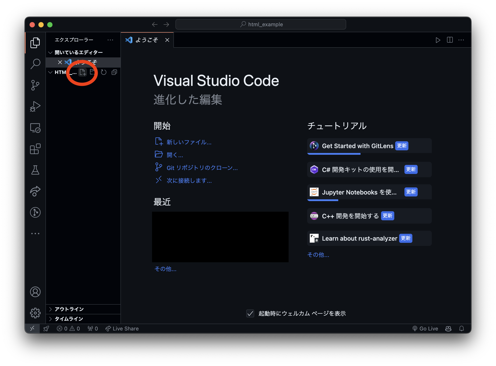
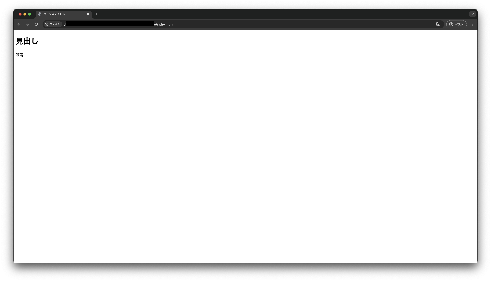
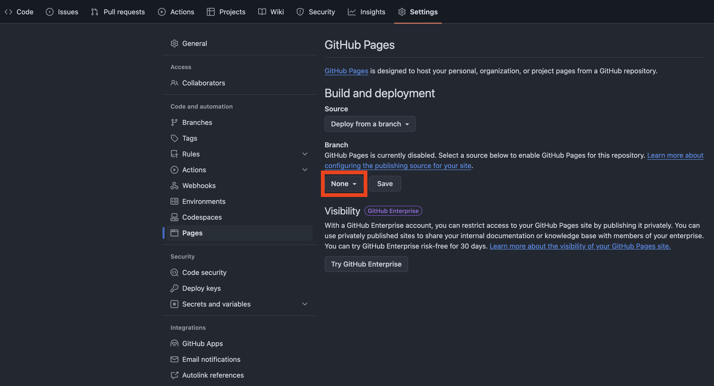
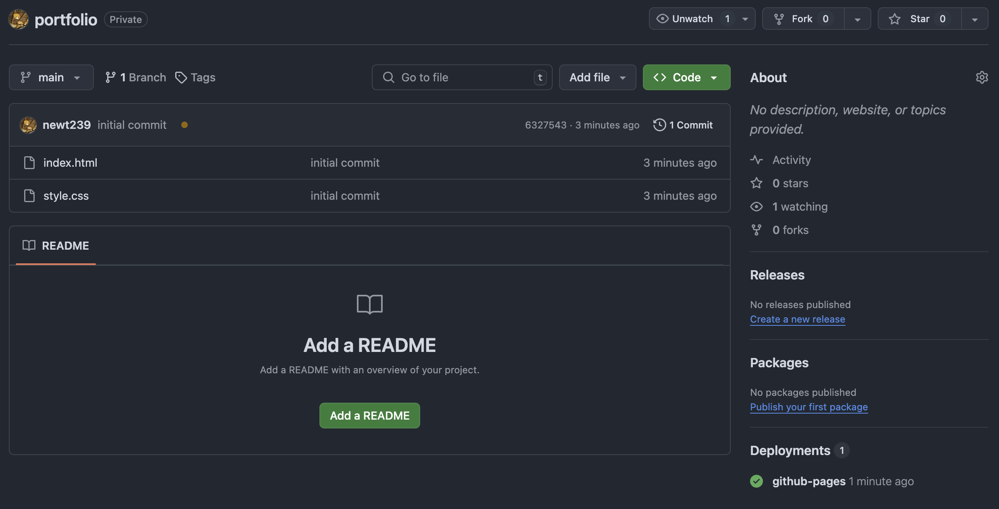

<!-- _class: invert -->

# 1. 環境構築編

<div style="text-align:right;position:fixed;bottom:3rem;right:3rem;">
ポートフォリオサイトを作ろうハンズオン

[@newt239](https://newt239.dev/)

</div>

---

### このセクションのゴール

- 環境構築を完了する
- GitHub Pages で Web サイトを公開する
- どんなサイトを作るか考える

---

### 目次

1. 最低限必要な知識
1. 準備
1. GitHub Pages での公開
1. ウェブサイトのデザインを考える

---

<!-- _class: lead -->

## 01-1. 最低限必要な知識

---

### 心構え

#### 書き方を覚えようとしないでください。

量が膨大というのもありますが、特に Web 技術は日々進化しているため、数年前の常識が通用しないことがあります。個人的には写経（サンプルコードを 1 文字ずつ書き写すこと）にも意味がないと思っているので、どんどんコピペしてください。

そもそもこれはテストではないので、「勉強」という意識を持たないほうがラクです。

一方でもしエンジニアを目指しているのであれば、サンプルコードを読んで「どのコードがどこに影響を与えているか」を理解しながら進めることをおすすめします。

---

### 心構え

#### 書き方を覚えるのではなく、調べ方を覚えてください。

詰まったときは信頼できるドキュメントを見るのが一番ですが、英語であることが多いので、ハードルを感じる場合は以下に挙げるサイトがおすすめです。

- [MDN Web Docs](https://developer.mozilla.org/ja/)
- [HTML&CSS 入門：イチから Web デザインを習得する講座](https://saruwakakun.com/html-css/basic)

ChatGPT や GitHub Copilot などの生成 AI を活用するのも良いでしょう。

---

### 各言語の役割

- HTML: 文書の構造を記述
  - 「ここが見出し」「ここが段落」など
- CSS: デザインを記述
  - 「見出しは赤色」「段落のフォントサイズは 16px」など
- JavaScript: 動的な挙動を記述
  - 「ボタンをクリックしたらローディングアニメーションを表示」など

ウェブページを開いたときに表示されているのはほとんどの場合 HTML です。

基本的に CSS と JavaScript は HTML から呼び出されます。

今回のハンズオンでは HTML と CSS のみを扱います。

---

<!-- _class: lead -->

## 01-2. 準備

---

### 事前準備

#### 必要なアカウント

- [GitHub](https://github.com/)
  - リモートリポジトリのホスティングサービス

#### 必要なソフトウェア

- [Git](https://git-scm.com/)
  - バージョン管理ツール
- [Visual Studio Code](https://code.visualstudio.com/)
  - 多機能なコードエディタ

---

### 環境構築

https://prog-8.com/docs/git-env-win

- Progate のガイドを参考に進めて下さい
- メールアドレスは個人のものを推奨

#### Mac の場合

1. [XCode](https://developer.apple.com/xcode/)にアクセス
1. 右上の Download をクリック
1. App Store が開くので、 XCode をインストール

---

### Visual Studio Code のダウンロード

1. [Visual Studio Code](https://code.visualstudio.com/) にアクセス
2. OS に合わせてインストーラをダウンロード
3. インストール

#### 補足: Visual Studio Code とは

- Microsoft が主導して開発しているオープンソースのテキストエディタ
- 一般的に **VSCode** と呼ばれるので、本資料でも以降は VSCode と表記します
- 「Visual Studio」と「Visual Studio Code」は別物です

---

### VSCode の設定

#### 拡張機能のインストール

- VSCode を起動し、左側のアイコンが縦に並んだエリアから「拡張機能」タブを探す
- 「HTML CSS Support」と「Live Server」を検索してインストール



---

<!-- _class: lead -->

## 01-3. GitHub Pages での公開

---

### GitHub Pages とは

- GitHub が提供する静的 Web ホスティングサービス
- 以前はレンタルサーバーを契約し、FTP クライアントなどを使って公開したいファイルをアップロードする必要があったが、近年は Git でソースコードを管理し、GitHub に push するだけで Web サイトを公開できるサービスが増えている
- 同様の他のサービスとしては Netlify や Vercel, Firebase Hosting, Cloudflare Pages などがある（いずれも無料で公開可能）

---

### Git と GitHub の違い

- **Git**はプログラムのバージョンを管理するための**ソフトウェア**
- **GitHub**は Git で管理されたプログラムをクラウド上で管理するための**Web サービス**
  - 同様の Web サービスとして GitLab, Bitbucket などもある
- GitHub は Git の機能に加え、Issue(プロジェクトの問題やタスク) を管理する機能や共同開発を支援する機能などを提供している
- GitHub Pages は GitHub が提供するサービスの一つ

---

### GitHub でリポジトリを作成する

- GitHub にログインし、右上の[「+」をクリック](https://github.com/new)して「New repository」を選択
- Repository name は `<username>.github.io` とする
  - `<username>` は GitHub のユーザ名に変更してください
- Visibility は Public のまま
  - 認証情報（シークレットキーや個人情報）を載せないよう注意！
- Create repository をクリック
- 作成後に遷移したページの URL をコピー
  - 次のページで使います



---

### HTML ファイルを作成してみよう

1. VSCode を起動し、左上の「ファイル」→「フォルダを開く」から「ドキュメント」フォルダを開く
1. 「表示」→「ターミナル」を開く
1. 下のコマンドを入力し、Enter

```bash
git clone <先ほどコピーしたURL>
```

1. 左側「エクスプローラー」タブの上で右クリックし、「新しいファイル」
1. ファイル名を`index.html`として Enter



---

### HTML をブラウザで表示してみよう

- 作成した HTML ファイルに先ほどのコードを書き込む（コピペ推奨）

```html
<!DOCTYPE html>
<html lang="ja">
  <head>
    <meta charset="UTF-8" />
    <title>ページのタイトル</title>
  </head>
  <body>
    <h1>見出し</h1>
    <p>段落</p>
  </body>
</html>
```

- ファイルを保存し、VSCode 右下の「Go Live」をクリック
  - エクスプローラーから HTML ファイルをダブルクリックすることでも表示できますが、この方法を用いることでリアルタイムで（再起動することなく）変更を確認できます

---

### HTML をブラウザで表示してみよう

<div style="text-align: center;">

:tada: :tada: :tada:



</div>

---

### Git でコミット＆プッシュする

- VSCode 左上のメニューから「ターミナル」→「新しいターミナル」を選択
- 以下のコマンドを入力

```bash
git init
git remote add origin さっきコピーしたURL
git add .
git commit -m "first commit"
git push origin main
```

- コマンドは 1 行ずつコピーして貼り付け、実行（Enter）
- 最後のコマンドに失敗する場合、`main`を`master`に変更
- いまのところコマンドの意味を理解する必要はありません！

---

### GitHub Pages で公開する

- コマンド実行後、GitHub で開いているページをリロード
- 「Settings」→「Pages」を選択
- Branch を main（または master） にして Save



---

### 公開できたことを確認

- Code タブに戻り、黄色い丸が緑のチェックマークになるまで待つ
  - 30 秒程度でリロードしてみてください
- 右下の Deployments の github-pages をクリックし、URL をクリック！



---

<!-- _class: lead -->

## ウェブサイトのデザインを考える

---

### 世の中の Web サイトを見てみよう

- SANKOU! | Web デザインギャラリー・参考サイト集
  - https://sankoudesign.com/
- デジタル庁
  - https://www.digital.go.jp/
- pixiv
  - https://www.pixiv.net/
- Gigazine
  - https://gigazine.net/
- にじさんじフェス 2025
  - https://fes.nijisanji.jp/2025/

---

### デザインを考える

- 大まかなページ構成を考える
  - トップページ、プロフィール、作品集、お問い合わせなど
- レイアウトを考える
  - サイドバー、ヘッダー、フッターなど
- 配色を考える

次ページでは Web デザインの制作でよく利用されている Figma というサービスを紹介しますが、今回は好きなツール（紙 or ペイントツール）でデザインを考えてもらって構いません。

---

### Figma を使ってデザインを考える

- [Figma](https://www.figma.com/) にアクセスし、アカウントを作成
- 学割のプログラムがあるので申請すると良い
  - https://www.figma.com/ja-jp/education/

---

<!-- _class: lead -->

第 1 回の内容は以上です。お疲れ様でした！
