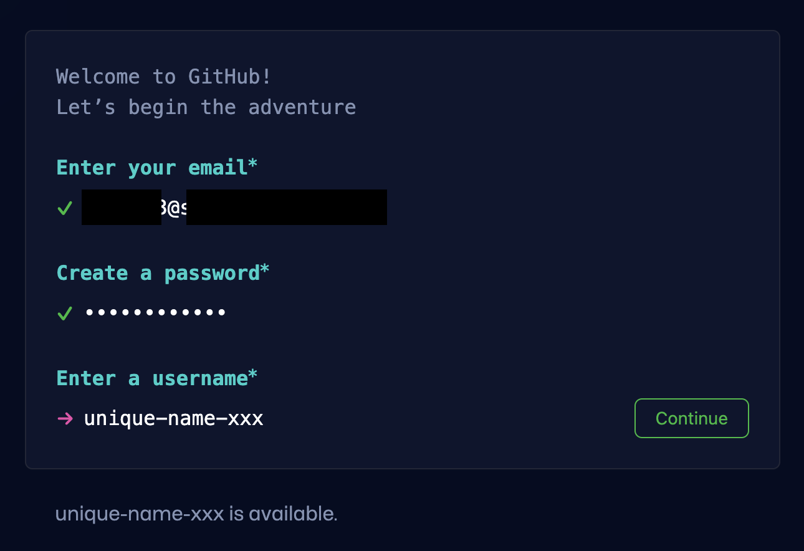
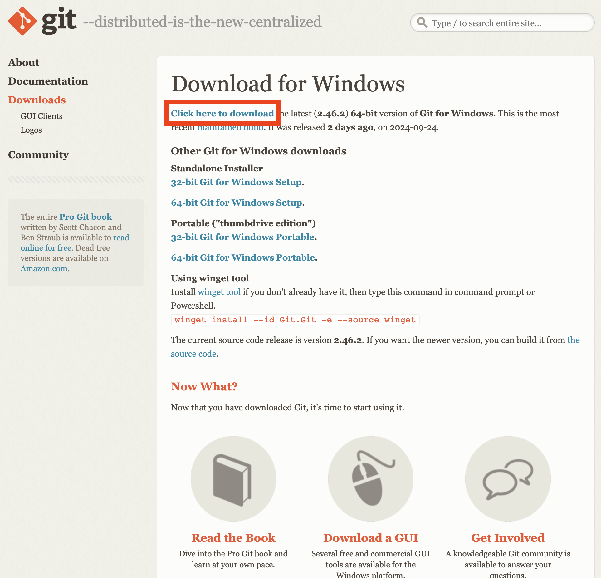
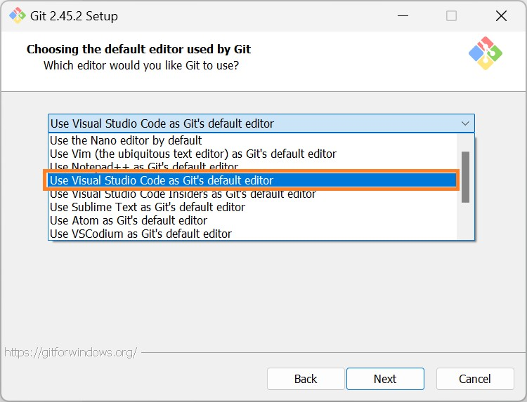

<!-- _class: invert -->

# 1. 環境構築編

<div style="text-align:right;position:fixed;bottom:3rem;right:3rem;">
ポートフォリオサイトを作ろうハンズオン

2024-10-19 / [@newt239](https://newt239.dev/)

</div>

---

### このセクションのゴール

- 環境構築を完了する
- GitHub Pages で Web サイトを公開する

---

### 目次

1. 準備
1. 最低限必要な知識
1. GitHub Pages での公開

---

<!-- _class: lead -->

## 01-1. 準備

---

### 事前準備

#### 必要なソフト

- [Git](https://git-scm.com/)
  - バージョン管理ツール
- [Visual Studio Code](https://code.visualstudio.com/)
  - コードエディタ

#### 必要なアカウント

- [GitHub](https://github.com/)
  - リモートリポジトリのホスティングサービス

---

### GitHub アカウントの作成

1. [GitHub](https://github.com/) にアクセス
1. 右上の`Sign up` をクリック
1. メールアドレス、パスワード、ユーザ名を設定
1. bot テストのミニゲームをクリア
1. メールで送られた認証コードを入力
1. プランは Free を選択

- メールアドレスは個人のものを推奨
- ユーザ名は他人と被っている場合利用できません



---

### Git のダウンロード

#### Windows の場合

1. [Git for Windows](https://gitforwindows.org/) にアクセス
1. **Click here to download** をクリック

#### Mac の場合

1. [XCode](https://developer.apple.com/xcode/)にアクセス
1. 右上の Download をクリック
1. App Store が開くので、 XCode をインストール



---

### Git のインストール

#### Windows の場合

1. ダウンロードフォルダにある exe ファイルをダブルクリック
1. ウィザードが立ち上がるので、基本的に右下の「Next」をクリックし続ける
1. 「Choosing the default editor used by Git」画面で、Use Visual Studio Code as Git's default editor を指定する



---

### Git の設定

- スタートメニュー(左下 Windows アイコン)から Git Bash を起動
  - Mac の場合は「アプリケーション」の「ユーティリティ」フォルダにあるターミナルを起動
- 下記のコマンドを入力して、ユーザ名とメールアドレスを設定

```bash
git config --global user.name "ここにGitHubのユーザ名"
```

```bash
git config --global user.email "ここにGitHubのメールアドレス"
```

- 特にエラーが出ていなければ設定完了

---

### Visual Studio Code のダウンロード

1. [Visual Studio Code](https://code.visualstudio.com/) にアクセス
2. OS に合わせてインストーラをダウンロード
3. インストール

#### 補足

- Microsoft が主導して開発しているオープンソースのコードエディタ
- 一般的に **VSCode** と呼ばれるので、本資料でも以降は VSCode と表記します

---

### Visual Studio Code の設定

#### 拡張機能のインストール

- VSCode を起動し、左側のアイコンから拡張機能を検索
- 「HTML CSS Support」と「Live Server」をインストール


---

<!-- _class: lead -->

## 01-2. 最低限必要な知識

---

### 心構え

#### 書き方を覚えようとしないでください。

量が膨大というのもありますが、特に Web 技術は日々進化しているため、数年前の常識が通用しないことがあります。個人的には写経（サンプルコードを書き写すこと）にも意味がないと思っているので、どんどんコピペしてください。

そもそもこれはテストではないので、「勉強」という意識を持たないほうがラクです。

---

### 心構え

#### 書き方を覚えるのではなく、調べ方を覚えてください。

詰まったときは信頼できるドキュメントを見るのが一番ですが、英語であることが多いので、ハードルを感じる場合は以下に挙げるサイトがおすすめです。

- [MDN Web Docs](https://developer.mozilla.org/ja/)
- [HTML&CSS 入門：イチから Web デザインを習得する講座](https://saruwakakun.com/html-css/basic)

ChatGPT や GitHub Copilot などの生成 AI を活用するのも良いでしょう。

---

### 各言語の役割

- HTML: 文書の構造を記述
  - 「ここが見出し」「ここが段落」など
- CSS: デザインを記述
  - 「見出しは赤色」「段落のフォントサイズは 16px」など
- JavaScript: 動的な挙動を記述
  - 「ボタンをクリックしたらローディングアニメーションを表示」など

ウェブページを開いたときに表示されているのは殆どの場合 HTML です。

基本的に CSS や JavaScript は HTML から呼び出されることが多いです。

---

<!-- _class: lead -->

## 01-3. GitHub Pages での公開

---

### GitHub Pages とは

- GitHub が提供する静的 Web ホスティングサービス
- 以前はレンタルサーバーを契約し、FTP クライアントなどを使って公開したいファイルをアップロードする必要があったが、近年は Git でソースコードを管理し、GitHub に push するだけで Web サイトを公開できるサービスが増えている
- 同様の他のサービスとしては Netlify や Vercel, Firebase Hosting, Cloudflare Pages などがある（いずれも無料で公開可能）

---

### Git と GitHub の違い

- **Git**はプログラムのバージョンを管理するための**ソフトウェア**
- **GitHub**は Git で管理されたプログラムをクラウド上で管理するための**Web サービス**
  - 同様の Web サービスとして GitLab, Bitbucket などもある
- GitHub は Git の機能に加え、Issue(プロジェクトの問題やタスク) を管理する機能や共同開発を支援する機能などを提供している
- GitHub Pages は GitHub が提供するサービスの一つ

---

### GitHub でリポジトリを作成する

- [GitHub にログインし、右上の「+」をクリックして「New repository」を選択](https://github.com/new)
- Repository name にはお好きなものを
  - `https://username.github.io/[ここがリポジトリ名になる]/`
- Public/Private は自由
  - 認証情報を載せないよう注意！
- Create repository をクリック
- 作成後に遷移したページの URL をコピー


---

### Git でコミット＆プッシュする

- VSCode 左上のメニューから「ターミナル」→「新しいターミナル」を選択
- 以下のコマンドを入力

```bash
git init
git add .
git commit -m "first commit"
git remote add origin さっきコピーしたURL
git push origin main
```

- コマンドは 1 行ずつ実行（Enter）
- 最後のコマンドに失敗する場合、`main`を`master`に変更
- いまのところコマンドの意味を理解する必要はありません！

---

### GitHub Pages で公開する

- コマンド実行後、GitHub で開いているページをリロード
- 「Settings」→「Pages」を選択
- Branch を main（または master） にして Save


---

### 公開できたことを確認

- Code タブに戻り、黄色い丸が緑のチェックマークになるまで待つ
  - 30 秒程度でリロードしてみてください
- 右下の Deployments の github-pages をクリックし、URL をクリック！


---

<!-- _class: lead -->

第 1 回の内容は以上です。お疲れ様でした！
